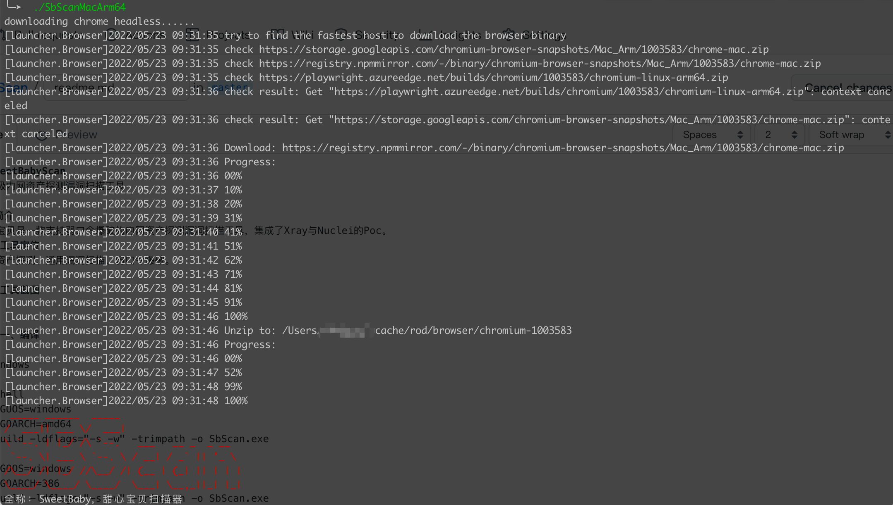
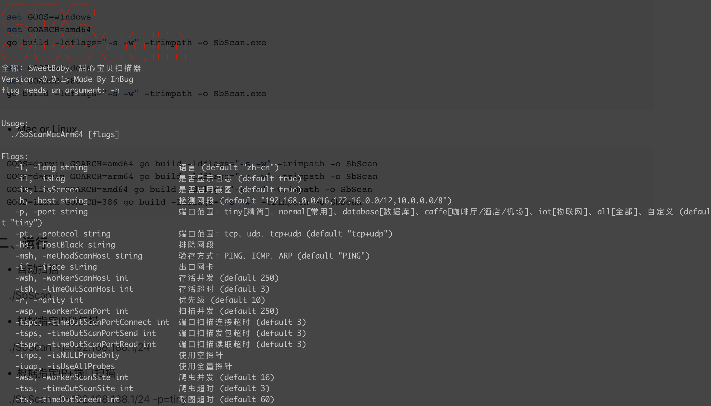
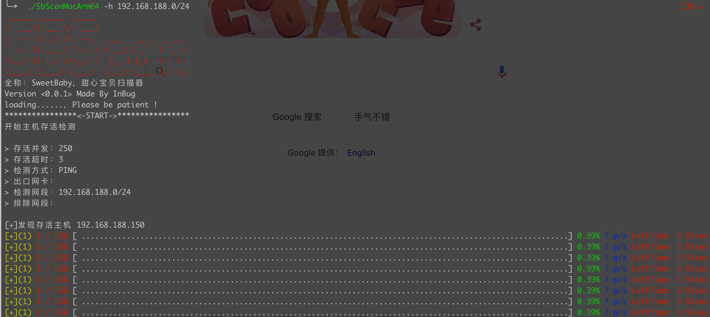
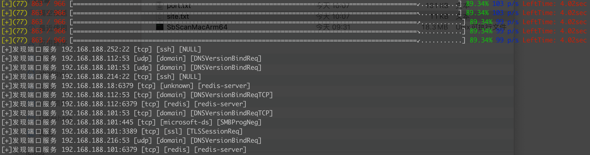
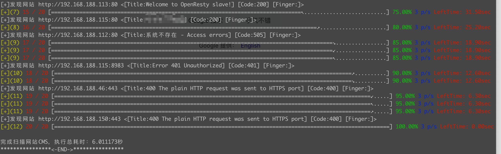
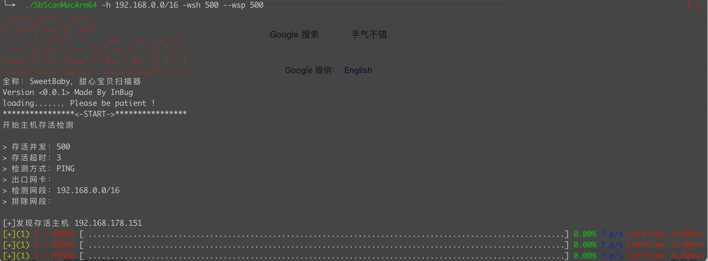
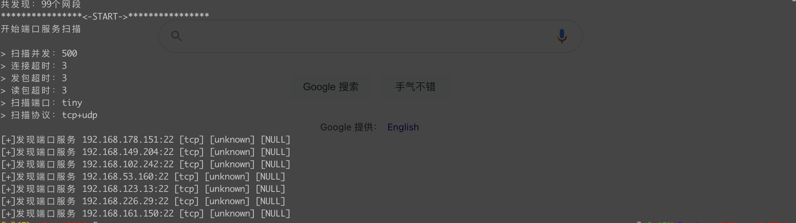
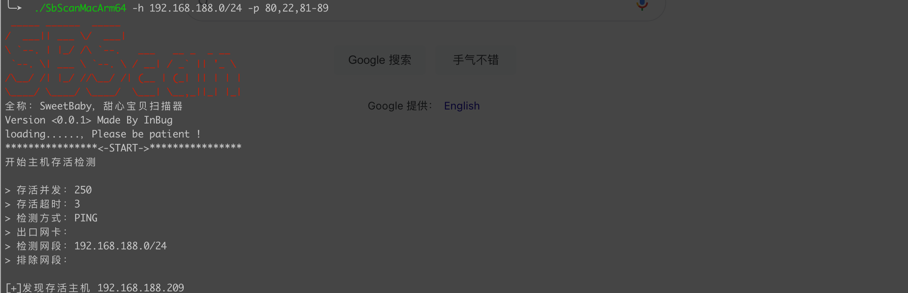
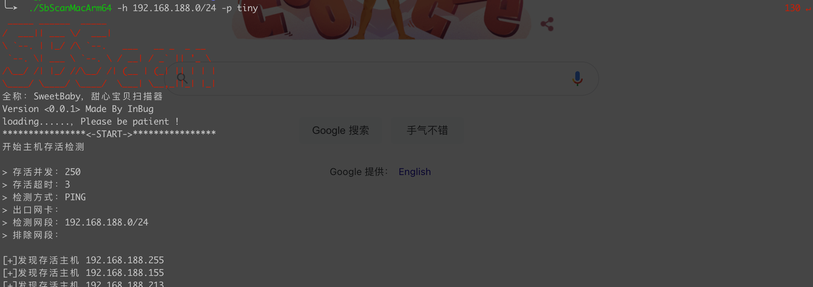

# SweetBabyScan
轻量级内网资产探测漏洞扫描工具

## 简介
甜心宝贝是一款支持弱口令爆破的内网资产探测漏洞扫描工具，集成了Xray与Nuclei的Poc
### 工具定位
内网资产探测、通用漏洞扫描、弱口令爆破

### 工具截图
工具工具系统自动下载对应版本的Chromium






调高探测与扫描并发
```
./SbScan -h 192.168.0.0/16 -wsh 500 --wsp 500
```




端口扫描可以写端口号、端口范围或者常用端口类型
```
./SbScan -h 192.168.188.0/24 -p 80,22,81-89
```




### 一、编译

- Windows

```shell
set GOOS=windows
set GOARCH=amd64
go build -ldflags="-s -w" -trimpath -o SbScan.exe

set GOOS=windows
set GOARCH=386
go build -ldflags="-s -w" -trimpath -o SbScan.exe
```

- Mac or Linux

```shell
GOOS=darwin GOARCH=amd64 go build -ldflags="-s -w" -trimpath -o SbScan
GOOS=darwin GOARCH=arm64 go build -ldflags="-s -w" -trimpath -o SbScan
GOOS=linux GOARCH=amd64 go build -ldflags="-s -w" -trimpath -o SbScan
GOOS=linux GOARCH=386 go build -ldflags="-s -w" -trimpath -o SbScan
```

### 二、运行

- 自动扫描

> ./SbScan


- 根据指定IP段扫描

> ./SbScan -h=192.168.188.1/24

- 根据指定IP+端口扫描

> ./SbScan -h=192.168.188.1/24 -p=tiny

> ./SbScan -h=192.168.188.1/24,10.0.0.1/16 -p=22,80,443

- Linux & Mac临时修改最大打开文件限制，提升并发性能

> ulimit -n 65535 && ./SbScan -wsh=2048 -wsp=1024 -h=192.168.188.1/24,10.0.0.1/16 -p=22,80,443

### 三、参数

- 查看参数帮助命令

> ./SbScan --help

```text
Usage:
  ./SbScan [flags]

Flags:
   -l, -lang string                    语言 (default "zh-cn")
   -il, -isLog                         是否显示日志 (default true)
   -is, -isScreen                      是否启用截图 (default true)
   -h, -host string                    检测网段 (default "192.168.0.0/16,172.16.0.0/12,10.0.0.0/8")
   -p, -port string                    端口范围：tiny[精简]、normal[常用]、database[数据库]、caffe[咖啡厅/酒店/机场]、iot[物联网]、all[全部]、自定义 (default "tiny")
   -pt, -protocol string               端口范围：tcp、udp、tcp+udp (default "tcp+udp")
   -hb, -hostBlack string              排除网段
   -msh, -methodScanHost string        验存方式：PING、ICMP、ARP (default "PING")
   -if, -iFace string                  出口网卡
   -wsh, -workerScanHost int           存活并发 (default 250)
   -tsh, -timeOutScanHost int          存活超时 (default 3)
   -r, -rarity int                     优先级 (default 10)
   -wsp, -workerScanPort int           扫描并发 (default 250)
   -tspc, -timeOutScanPortConnect int  端口扫描连接超时 (default 3)
   -tsps, -timeOutScanPortSend int     端口扫描发包超时 (default 3)
   -tspr, -timeOutScanPortRead int     端口扫描读取超时 (default 3)
   -inpo, -isNULLProbeOnly             使用空探针
   -iuap, -isUseAllProbes              使用全量探针
   -wss, -workerScanSite int           爬虫并发 (default 16)
   -tss, -timeOutScanSite int          爬虫超时 (default 3)
   -ts, -timeOutScreen int             截图超时 (default 60)
```

### 四、更新日志

```text
2022-05-20（v0.0.1）
    [+]1.主机存活检测
    [+]2.端口服务扫描
    [+]3.网站指纹爬虫
```


### 五、参考项目

- 致谢🙏🙏🙏

```text
1.nuclei：https://github.com/projectdiscovery/nuclei
2.xray：https://github.com/chaitin/xray
```

### Star Chart

[](https://starchart.cc/inbug-team/SweetBabyScan)

**官网**
https://www.inbug.org

同时也可通过公众号联系：

